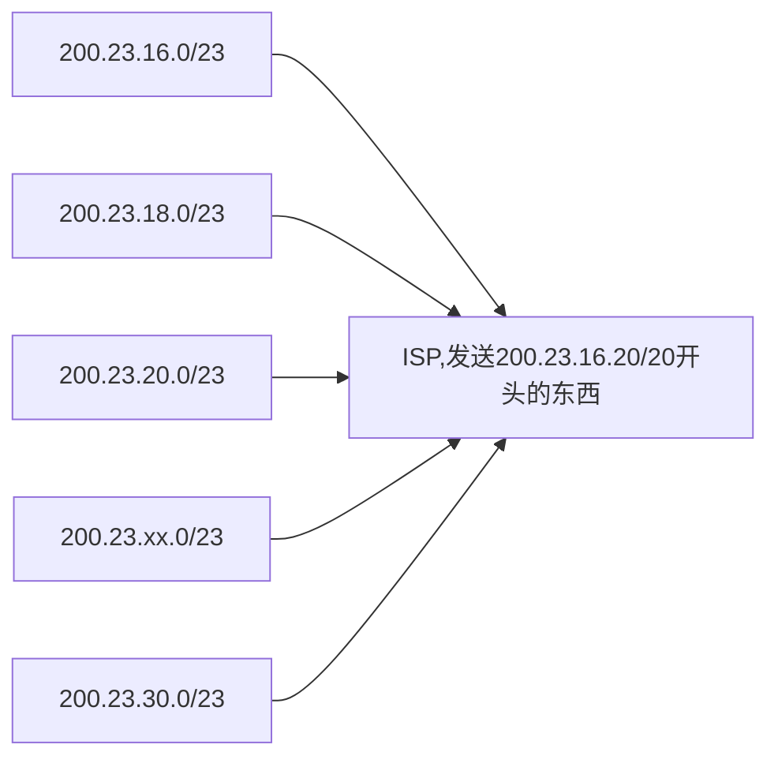

# 计算机网络

主要是复习的时候用的

## 网络模型

- 四层网络模型
  - 应用层，传输层，网络层，数据链路层
    - 应用层：FTP, SMTP, HTTP, DNS 等，进程之间的交互的最小单位
    - 传输层：TCP, UDP, 使用这些协议来保证进程之间的通讯，就是不丢包 -> 
    - 网络层：IP，ICMP, 在不同网络之间路由，实现IP地址的封装  -> 路由器 ip地址和路由转发
    - 数据链路层：接口之间如何通讯，传输的介质等 -> 交换机 Mac 地址，传输单位是帧
- 五层网络模型
  - 应用层, 传输层，网络层，链路层，物理层
  - 物理层：集线器，负责信号的再生。
- 七层OSI网络模型
  - 应用层，表示层，会话层，传输层，网络层，数据链路层，物理层

作为程序员，其实用四层网络模型就可以了

## ip地址，子网掩码，默认网关，dns服务器

子网掩码可以根据ip地址来划分哪一个是网络位，哪一个是主机位

- `233.1.1.0/24`: 表示的是32位比特的最左侧24比特定义了子网地址，因为分割的时候1位是8比特，那么前3位都是一样的。

这就是子网掩码的作用，。

### IP地址的分类

网络号：主机连接的是互联网中的哪一个网络
主机号：表示在这个网络中的哪一个主机  

- A类地址：
  - 1字节的网络地址和3字节的主机地址
  - 地址范围是0.0.0.0~127.0.0.0，A类网络是127个，每一个网络中可以容纳$2^{24}=16777214$个主机, 当然有些地址不能用，127.0.0.1是特殊地址，表示自身ip地址，即localhost
  - 默认网关就是255.0.0.0
- B类地址：
  - 2字节的网络地址和2字节的主机地址
  - 最高位必须是10

