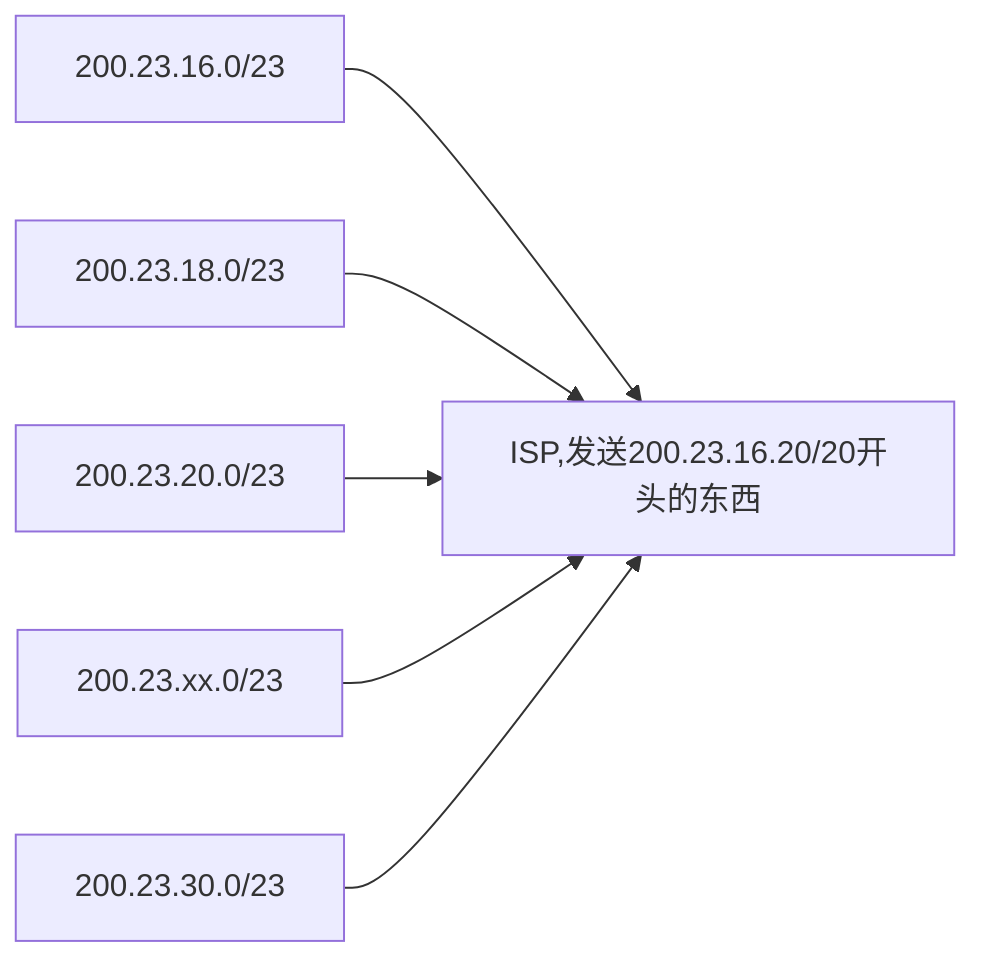

# 计算机网络

主要是复习的时候用的

## 网络交换

### 交换媒介

双绞线、同轴电缆、光纤、无线传输媒介，光缆，短波通信，卫星等。

### 交换方式

- 电路交换：面向连接，双方进行通讯之前，要建立一个连接通道，着连接通道是独占的，就是其他人已经不能用了，传送的是模拟信号
- 报文交换：以报文为数据交换的单位，报文中含有目的地址和源地址的信息，一次一跳，跳到一个节点之后，如果太多了，就会进行丢包
- 分组交换：无连接，直接通讯，可以并行传输，效率要比报文高

## 网络模型

- 四层网络模型
  - 应用层，传输层，网络层，数据链路层
    - 应用层：FTP, SMTP, HTTP, DNS 等，进程之间的交互的最小单位
    - 传输层：TCP, UDP, 使用这些协议来保证进程之间的通讯，就是不丢包
    - 网络层：IP，ICMP, 在不同网络之间路由，实现IP地址的封装  -> 路由器 ip地址和路由转发
    - 数据链路层：接口之间如何通讯，传输的介质等 -> 交换机 Mac 地址，传输单位是帧
- 五层网络模型
  - 应用层, 传输层，网络层，链路层，物理层
  - 物理层：集线器，负责信号的再生。
- 七层OSI网络模型
  - 应用层，表示层，会话层，传输层，网络层，数据链路层，物理层

- 应用层：传输的是信心或者报文
- 传输层：传输的是数据段
- 网络层：传输的是数据包
- 链路层：传输的是帧，mac地址进行寻址
- 物理层：传输的是比特流

作为程序员，其实用四层网络模型就可以了

## ip地址，子网掩码，默认网关，dns服务器

子网掩码可以根据ip地址来划分哪一个是网络位，哪一个是主机位

- `233.1.1.0/24`: 表示的是32位比特的最左侧24比特定义了子网地址，因为分割的时候1位是8比特，那么前3位都是一样的。

这就是子网掩码的作用，。

### IP地址的分类

网络号：主机连接的是互联网中的哪一个网络
主机号：表示在这个网络中的哪一个主机  

- A类地址：1~127 -> $0$0000001 ~ $0$1111111
  - 1字节的网络地址和3字节的主机地址
  - 地址范围是0.0.0.0~127.0.0.0，A类网络是127个，每一个网络中可以容纳$2^{24}=16777214$个主机, 当然有些地址不能用，127.0.0.1是特殊地址，表示自身ip地址，即localhost
  - 默认网关就是255.0.0.0
- B类地址：128~191 $10$000000 ~ $10$111111
  - 2字节的网络地址和2字节的主机地址
- C类地址：192~223 $119$00000 ~ $110$11111
  - 3字节的网络地址和1字节的主机地址
  - 默认网关是255.255.255.0
- D类地址：224~239 $1110$0000 ~ $1110$1111
- E类地址：240~255 $1111$0000 ~ $1111$11111

默认网关：其实就是路由器，子网与外网连接的设备，通过子网掩码来判断一个主机是否在本地子网中，如果目标主机在子网中，那么直接发送就行了，如果不在，那么就交给路由器，路由器会发送到其他网络中，寻找目标主机

## 实体与网络模型的对应

- 网关：不同网络或协议之间进行数据交换的设备和服务器
- 路由器：网络层
  - 作用：具有连接不同类型网络的功能，并可以选择数据传送路径的设备。
- 网桥：数据链路层
- 交换机：数据链路层
  - 作用：根据mac地址进行寻址，扩展互联网，连接更多的设备
- 集线器：物理层
